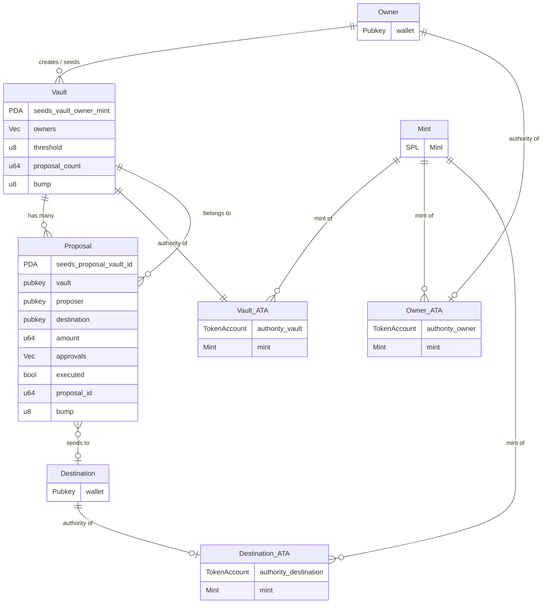
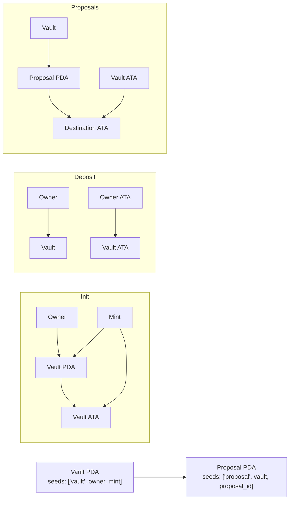

# Capstone Vault Program

A Program that implements a **multi-signature token vault**: multiple owners control a shared token account, and outgoing transfers require a configurable threshold of owner approvals via proposals.

## Overview

- **Program ID:** `HdeZQYeeWuyrdmVmmyM1u4iUq6iNhhYTY73oNZjzqJLX`
- **Model:** One vault per `(owner, mint)` pair. The “owner” in the vault PDA is the vault creator; the vault itself has a list of up to 5 **owners** and a **threshold** (e.g. 2-of-3).
- **Flow:** Initialize vault → Deposit tokens → Create proposal → Approve (until threshold) → Execute proposal (transfer from vault to destination).

## Instructions

| Instruction | Description |
|-------------|-------------|
| `initialize_vault` | Create a vault PDA and its associated token account (ATA). Sets `owners`, optional `threshold` (default 2), and optional `is_active`. Caller must be in `owners`. |
| `deposit` | Transfer tokens from the signer’s ATA into the vault’s ATA. Signer must match the vault’s PDA “owner” (creator). |
| `create_proposal` | Create a proposal to send `amount` to `destination`. Only vault owners can create. Increments `vault.proposal_count` and assigns `proposal_id`. |
| `approve_proposal` | Record the signer’s approval for a proposal. Each owner can approve at most once; proposal must not be executed. |
| `execute_proposal` | If approvals ≥ `vault.threshold` and proposal not executed, transfer `proposal.amount` from vault ATA to `proposal.destination`’s ATA, then mark proposal executed. Vault PDA signs the transfer. |

## State

### Vault

- **Seeds:** `["vault", owner.key(), mint.key()]` (owner = vault creator)
- **Fields:** `owners` (max 5), `threshold`, `proposal_count`, `bump`, optional `is_active`
- **Token account:** Vault has an ATA for the same mint, with the **vault PDA** as authority.

### Proposal

- **Seeds:** `["proposal", vault.key(), proposal_id.to_le_bytes()]`
- **Fields:** `vault`, `proposer`, `destination`, `amount`, `approvals` (one bool per vault owner), `executed`, `proposal_id`, `bump`

## Errors

- **VaultError::Unauthorized** — Signer is not in the vault’s `owners` list.
- **ProposalError::ProposalAlreadyExecuted** — Execute or approve after execution.
- **ProposalError::ProposalAlreadyApproved** — Owner approving twice.
- **ProposalError::ThresholdNotReached** — Execute before enough approvals.

---

## Account relationships (Mermaid)

### PDA and account flow (by instruction)

- **Vault PDA:** `["vault", owner.key(), mint.key()]` — one vault per (creator, mint).
- **Proposal PDA:** `["proposal", vault.key(), proposal_id]` — one proposal per (vault, proposal_id).
- **Vault ATA:** Standard ATA for `(vault_pda, mint)`; vault is the token authority.
- **Destination ATA:** ATA for `(proposal.destination, mint)`; used only in `execute_proposal`.
